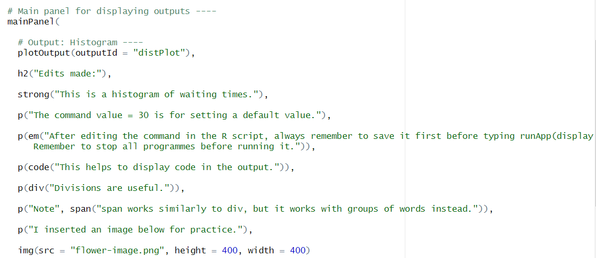
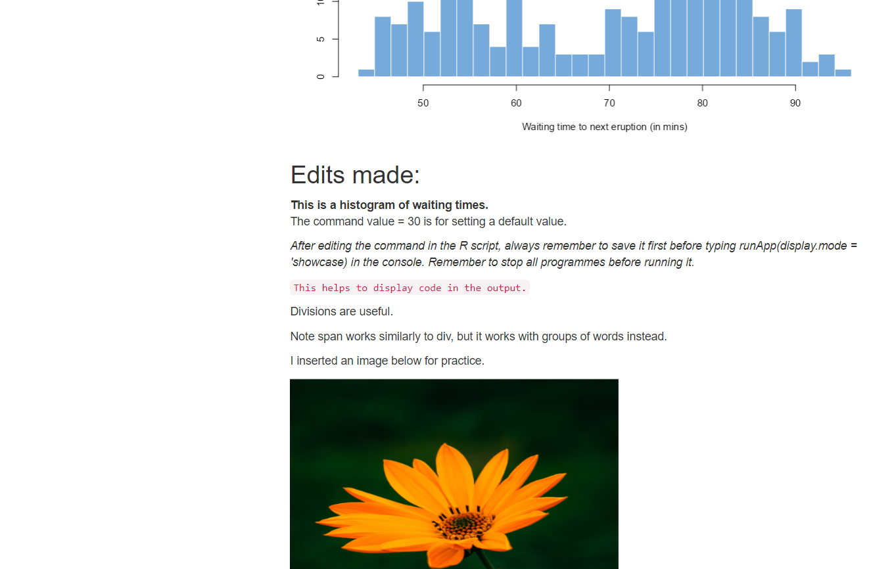

# II. Code to edit and execute using the Code-along-challenge-8.Rmd file 
<br>

## A. Shiny
<br>

### 1. Installing Shiny package (Slide #6)

```{r, eval=TRUE,echo=TRUE}

#run the commands in the console below instead of in the R markdown file if the CRAN mirror error pops up again

# r scripts can only take codes, rmd files can take texts & code

# A shiny script has 3 constants; key in under "help" in bottom right for more info (fluid page: configures input n output of dashboard, server: how input should be used n how output should look like, shiny app: define how the app looks like)

# sidebar layout: input one side, output another side

# look at app.R for other notes. 

# For div(), basically you can insert all the text within div like this instead of typing it separately like you did in the R script.
# div(HTML(
        "Hello <b>abc</b> <em>This is italic</em>
        <image><>"
      #))

```
<br>

### 2. Screenshots

```{r, out.height="600px",out.width="1000px",echo=TRUE,eval=TRUE,fig.cap="This is the screenshot for my edited R script."}
  
```

<br>
```{r, out.height="800px",out.width="1000px",echo=TRUE,eval=TRUE,fig.cap="This is the screenshot for the edited output of my app."}
 
```
<br>
